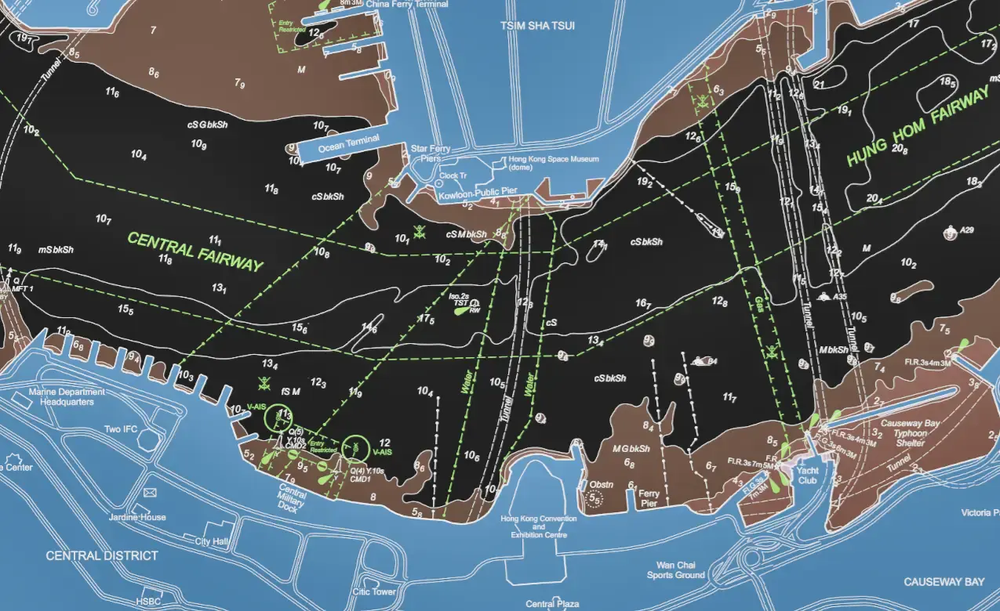

# hkopendata

This repo contains miscellaneous tools for downloading and analysing open geospatial data in Hong Kong.

Installation (CLI):

```sh
cd hkopendata
uv tool install "https://github.com/cathaypacific8747/hkopendata[cli]"
hkopendata --help
```

Installation (library):

```sh
uv add https://github.com/cathaypacific8747/hkopendata
```

Development:

```sh
git clone https://github.com/cathaypacific8747/hkopendata
uv sync --all-extras --all-groups
uv tool install ".[cli]" --editable
```

## features

### hydro

Download raster tiles from the Hong Kong Hydrographic Office, Marine Department:



### weather

Objective consensus forecast (OCF) weather predictions from the Hong Kong Observatory.

- forecast: https://www.hko.gov.hk/en/wxinfo/awsgis/regional_weather_gis.html
- anemometer: https://maps.hko.gov.hk/ocf/index_e.html

Wind Speed analysis for TC Nalgae:


Temp drop on 01 Dec 2022:
